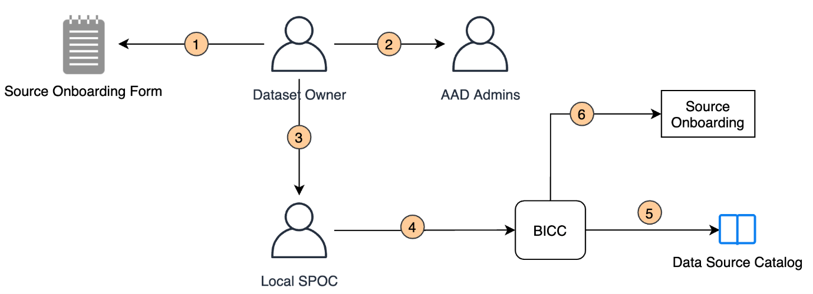

# Data Loading Strategy

## Data ingestion from source files

This process responsible for loading data from external sources, or sources that are not accessible via Azure Data Factory.

It is recommended to load data in small files\(~100MB\) instead of one large file. This allos to load data in parallel using multiple nodes.

## ETL design rules

### General

The landing will be loaded with the data from the different sources. If for some reason the data in the file or from the source table does not meet our expectations, the loading of the destination table will stop and the next file or source table will be loaded. If USPs are used for ETL purpose, these should be called from one Master USP.

### Naming conventions

* Always use English. If another language is required, approval from BICC should be requested.
* The naming of all the data packages should start with the target database. For example a package which load the staging should start with STG\_
* The naming of all the USPs should contain the target table. For example a staging USP which fills the DIM\_CUSTOMER table should be called USP\_STG\_DIM\_CUSTOMER.
* USPs to execute/control USPs: USP\_CTRL\_{Subject}.E.g. USP\_CTRL\_STG, USP\_CTRL\_DWH
* Only one entry point should be available. This is called the MasterUSP. MasterUSP should be called by the orchestration tool, e.g., Data Factory.
* All functional tables, stored procedures and views must be placed in the meta schema.
* Two types of stored procedures for Transformations:
  * USP \(User Stored Procedure\) written for local implementations/pipelines specific to the project
  * CSP \(Common Stored Procedure\) written by BICC to be shared by all countries for their implementation, e.g., procedures for loading the data from staging tables to dimension tables. CSPs can also have a DIV focus.

## Source Onboarding Process

The image below shows the source onboarding request. Source onboarding is required when it is the first time GDP will be ingesting the data from the source. Sources from which data has been ingested by the GDP at least once do not need to be onboarded because the BICC has complete information about ingestion of data from that particular data source.

The step by step onboarding process is defined below:

1. Dataset owner \(a person who is responsible for the data source\) fills in the source onboarding form with the help of the local IT team.
2. The source onboarding form requires the information about the security groups which will have RO/RW access to the data source. If the security groups are not present, the form is sent to the AAD administrators for creation of the groups.
3. Once the groups are created, the dataset owner is notified. He/she sends the form to the local SPOC.
4. Local SPOC sends the onboarding form to BICC.
5. BICC updates the data source catalog based on the information from the onboarding form.
6. BICC starts the process of onboarding the data source. The process includes:
7. Requesting the local SPOC for installation of Azure Integration Runtime \(AIR\) on the premises. BICC provides all the necessary information required for the installation as well as configuration of the AIR.
8. Local SPOC asks the local IT team for the installation of AIR if not already installed.
9. BICC validating the connection and loads a test table.

