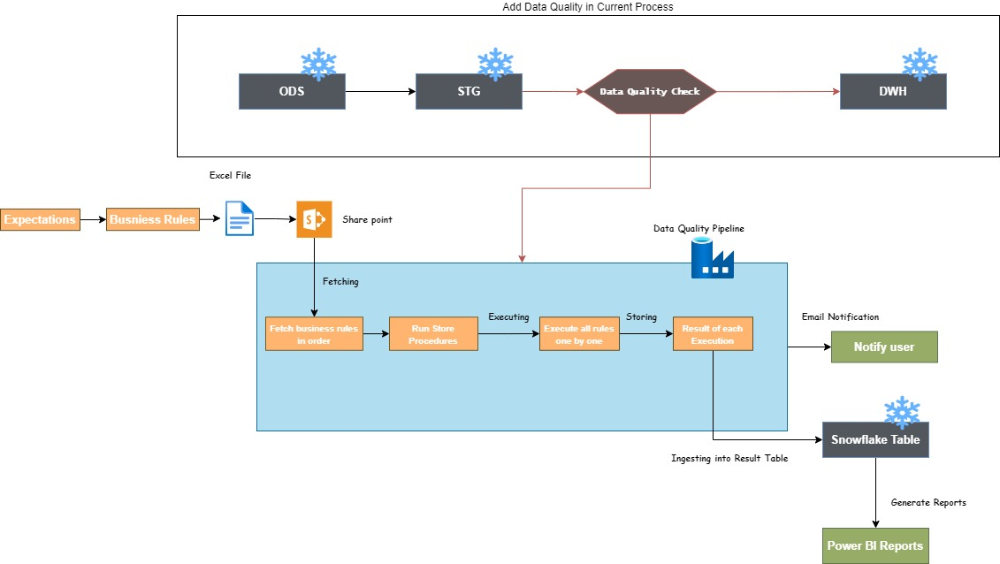

# Data Quality Framework

## Business Definition

This document covers the details of data quality evaluation process for Aliaxis business processes and its corresponding DWH tables. This document will enable the end users to define data quality rules and constraints in an excel file which will then be uploaded on the SharePoint from where it will be picked up by the daily ingestion process. These new tables will then act as the driving force for the entire data quality and business rule evaluation pipelines.

#### Business Rules Flow 

## How can I use it in Azure data factory (ADF)?
### **Option 1**: In your current ADF pipeline, add data quality after STG layer.


### **Option 2**: Data Quality can also be ensured when data manually uploaded into the ODS layer.


### **Data Quality Tables**

### Expectation
This table contains expectation of the business or process that needs to be evaluated based on and defined by the SQL queries in *Business Rule* table.
The structure of the metadata table is as follows

| Field Name | Description | Sample Value\(s\) |
| :--- | :--- | :--- |
| EXPECTATION_ID | Unique id assignment for the expectation, it could also be folder path for manual file ingestion | _Corporate_EMEA/SALES/sales-budget, sales-unique-id |
| DIVISION | Division name for which rule is defined | EMEA, AGRP |
| BUSINESS_UNIT | Business unit name for which the rule is defined | end-to-end, jimtem |
| BUSINESS_UNIT_COMPONENT |  Business unit component name for which the rule is defined | sales, crm, resinbi |
| EXPECTATION_DESCRIPTION | A meaningful statement explaning the expectation, this will be added to email notification | As business user, I would like to sure that commercial segaments are valid in manually uploaded file. |
| ENVIRONMENT | Name of the enviornment for which rule has beed defined | DEV, TST, PRD |
| DISTRIBUTION_LIST_TO | Comma(,) or semi-colon(;) separated email addresses | hhasan@aliaxis.com;cdelasmarinas@aliaxis.com |
| DISTRIBUTION_LIST_CC | Acronym for the division. Used to create the ADLS path where files are stored | flourenco@aliaxis.com |
| EMAIL_SUBJECT | Email subject for the expectation | EMEA Data Quality Check for Sales Budget |
| EMAIL_HTML_BODY | HTML email message for the expectation | \<p>Data quality rules are passed.\</p> |
| RAISE_EXCEPTION | Whether or not failed the pipeline on data quality compromise | True, False |
| SEND_ALERT | Whether or not send email alert on data quality compromise | True, False |
| IS_ACTIVE | Boolean attribute defines whether or not this expectation is active and should run or not. | True, False |
#### Query
``` 
SELECT * FROM {DIVISION}_{ENV}_ODS.MANUAL_UPLOADS.EXPECTATION_DQ
; 
```

### Business Rule
This table contains SQL queries for a given *Expectation* defined in expectation table.
For each SQL_STATEMENT, expected to return rows/rcords; a table will be created with all returned bad records with below format: 
`<DIVISION>_<ENV>_META.DATA_QUALITY.DQ_EXP<EXPECTATION NAME>_BR_<RULE ID>`

The structure of the metadata table is as follows
| Field Name | Description | Sample Value\(s\) |
| :--- | :--- | :--- |
| BUSINESS_RULE_ID | Unique id assignment for the business rule | 1234, unique-guid |
| SQL_STATEMENT | SQL query to be run against expectation, query `MUST` return rows i.e. If `any row returned` then quality check will be considered as failed | ```SELECT A.* FROM EMEA_DEV_ODS.MANUAL_UPLOADS.SALES_BUDGET A LEFT JOIN EMEA_DEV_DWH.SALES.DIM_COMPANY B ON A.COMPANY_CD = B.COMPANY_CD ;``` |
| RULE_DESCRIPTION | Description for the rule | Step 1: Check COMPANY_CD |
| HOW_TO_FIX | Details about how to fix this data quality issue | Make sure company codes are correct and matching with code defined in SALES.DIM_COMPANY table. |
| EXECUTION_ORDER | An order of execution for all SQL statements aka business rules against expectation. | 1,2,3,4,5,6... |
| IS_ACTIVE | Boolean attribute defines whether or not this expectation is active and should run or not. | True, False |
| EXPECTATION_ID | A foreign key reference to *Expectation* table | _Corporate_EMEA/SALES/sales-budget, sales-unique-id |
#### Query
``` 
SELECT * FROM {DIVISION}_{ENV}_ODS.MANUAL_UPLOADS.BUSINESS_RULE_DQ
; 
```

### Business Rule Result
This table contains results for a given *Business Rule* defined in business rules table.
| Field Name | Description | Sample Value\(s\) |
| :--- | :--- | :--- |
| BUSINESS_RULE_ID | Unique id referenced to the business rule | 1234, unique-guid |
| BUSINESS_RULE_STATUS | Status of evaluation for a given business rule | PASSED, FAILED |
| PROCESS_RUN_ID | ADF pipeline run id | 975882a0-772d-4e56-9ff3-ceeb01643532 |
| EXECUTION_RESULT | JSON Object contains execution logs |  ```{"BUSINESS_RULE_STATUS": "FAILED", "HOW_TO_FIX": "Make sure company codes are correct and matching with code defined in SALES.DIM_COMPANY table.", "RULE_DESCRIPTION": "Step 1:Check COMPANY_CD", "SQL_STATEMENT": "SELECT IFNULL (SUM (CASE WHEN B.COMPANY_CD IS NULL THEN 1 ELSE 0 END), 0) > -1 AS RESULT \nFROM \nEMEA_DEV_ODS.MANUAL_UPLOADS.SALES_BUDGET A LEFT JOIN \nEMEA_DEV_DWH.SALES.DIM_COMPANY B \nON A.COMPANY_CD=B.COMPANY_CD ;"}```|
| SF_TIMESTAMP | Datetime of execution for an evaluation. | 2022-01-07 06:08:11.353 -0800 |
#### Query
``` 
SELECT * FROM {DIVISION}_{ENV}_META.DATA_QUALITY.BUSINESS_RULE_RESULT
; 
```

### Azure Data Factory Pipeline (ADF)

Azure data factory pipeline can be used to trigger the expectation with set of business rules after certain point in master piplein(s). For example, this pipeline can be called after data has been ingested via manual upload process as well as after the STG ingestion to evaluate the quality of that after transformation.
`For each manual upload, if expectations and rules(in form of valid SQLs) are defined, process will try to evaluate the data quality.`
### Parameters

1. `EXPECTATION_ID` - optional if DIVISION,BUSINESS_UNIT and BUSINESS_UNIT_COMPONENT are supplied
2. `DIVISION` - optional if EXPECTATION_ID is supplied
3. `BUSINESS_UNIT` - optional if EXPECTATION_ID or DIVISION is supplied with *ALL* as value for this param
4. `BUSINESS_UNIT_COMPONENT` - optional if EXPECTATION_ID or DIVISION or BUSINESS_UNIT is supplied with *ALL* as value for this param
5. `FILE_NAME` - optional, can be sent from manaul uploads pipeline to add the filename in email body.

### ADF Pipeline Reference Query
```
SELECT * FROM EMEA_@{pipeline().globalParameters.ADLS_ENV}_ODS.MANUAL_UPLOADS.EXPECTATION_DQ
WHERE IS_ACTIVE = TO_BOOLEAN('TRUE')
AND  
(
    Upper('@{pipeline().parameters.EXPECTATION_ID}')  like Upper('%'||EXPECTATION_ID||'%')
    OR
    (
        UPPER("DIVISION") = UPPER('@{pipeline().parameters.DIVISION}')
		AND
		UPPER("BUSINESS_UNIT") = UPPER(CASE WHEN UPPER('@{pipeline().parameters.BUSINESS_UNIT}') = 'ALL' THEN "BUSINESS_UNIT" ELSE '@{pipeline().parameters.BUSINESS_UNIT}' END)
		AND
		UPPER("BUSINESS_UNIT_COMPONENT") = UPPER(CASE WHEN UPPER('@{pipeline().parameters.BUSINESS_UNIT_COMPONENT}') = 'ALL' THEN "BUSINESS_UNIT_COMPONENT" ELSE '@{pipeline().parameters.BUSINESS_UNIT_COMPONENT}' END)
    )
    
)
LIMIT 1;
```

### Sample Email Notification
Below is sample email notification generated by the process after evaluation of an expectation consists of multiple business rules.


## How to add my expectations and business rules?
To make the ingestion process easy and accessible to technical teams, expectations and business rules can be uploaded to SharePoint location as an excel file.
#### SharePoint Location
``` /<DIVISION//GDP_Data_Quality_Framework/business-rule/<filename>.xlsx ```

File must contain above mentioned fields required for tables in separate tabs.
[download the sample excel file for EMEA](../.gitbook/assets/sample-excel-file.xlsx)

## Sample Power BI Report for Data Quality
Below image shows sample data qaulity report on Power BI, based on results stored in *Business Rule Results*.


## Technical Guide
Stored procedure is used to execute the business rules one by one in an order specified in the business rules table.
Below is the code for the SP, which can directly be called from an pipeline or another SP:
```
CREATE OR REPLACE PROCEDURE DATA_QUALITY."USP_DATA_QUALITY_CHECK"("ENV" VARCHAR(16777216), "PROCESS_RUN_ID" VARCHAR(16777216), "EXPECTATION_ID" VARCHAR(16777216))
RETURNS VARCHAR(16777216)
LANGUAGE JAVASCRIPT
EXECUTE AS OWNER
AS '

// =============================================
// Name: USP_DATA_QUALITY_CHECK
// Parameters:
//              ENV: environment (DEV, TST, PRD)
//              PROCESS_RUN_ID: Pipeline Run ID to be used in the Monitoring module
//              IN_PROCESS_TS: TimeStamp to be used in some audit fields (ideally coming from Pipeline time execution)
//              EXPECTATION_ID: Unique id to refer the expectation e.g. _Corporate_EMEA/SALES/sales-budget
// Return: STRING
// Description: execution of DQ SQLs for given business expectation
// Change-Log:

// =============================================

var result = "DQ - execution of all business rules has been completed successfully (USP_DATA_QUALITY_CHECK)";
var sql_command = "";
var return_obj = [];
var return_result = null;

try{
    //FETCHING THE EXPECTATION RULES
    resp = snowflake.createStatement({
        sqlText: `SELECT *
                    FROM EMEA_${ENV}_ODS.MANUAL_UPLOADS.BUSINESS_RULE_DQ
                    WHERE UPPER("EXPECTATION_ID") = UPPER(:1) 
                    AND "IS_ACTIVE" = TRUE
                    ORDER BY EXECUTION_ORDER ASC`,
            binds: [EXPECTATION_ID]
        }).execute();

    // EXECUTING RULES ONE-BY-ONE
    while(resp.next()){
        var BUSINESS_RULE_ID = resp.getColumnValue(''BUSINESS_RULE_ID'');
        var SQL_STATEMENT = resp.getColumnValue(''SQL_STATEMENT'');
        var RULE_DESCRIPTION = resp.getColumnValue(''RULE_DESCRIPTION'');
        var HOW_TO_FIX = resp.getColumnValue(''HOW_TO_FIX'');
        // PREPAREING TABLE NAME
        var EXP_TABLE_NAME = `DQ_EXP_${EXPECTATION_ID}_BR_${BUSINESS_RULE_ID}`.replace(/[;:/-]/g,''_'');
        var EXP_FULL_TABLE_NAME = `EMEA_${ENV}_META.DATA_QUALITY.${EXP_TABLE_NAME}`;
        var TMP_EXP_FULL_TABLE_NAME = `EMEA_${ENV}_META.DATA_QUALITY.TMP_${EXP_TABLE_NAME}_${PROCESS_RUN_ID}`.replace(/[;:/-]/g,''_'');
        var EXP_TABLE_SCRIPT = `SELECT RESP_TBL.*,
            ''${PROCESS_RUN_ID}'' AS PROCESS_RUN_ID,
            CURRENT_TIMESTAMP AS DQ_TIMESTAMP
            FROM ( ${SQL_STATEMENT} ) RESP_TBL`;

        // CREATE TABLE ONLY
        snowflake.createStatement({
            sqlText: `CREATE TABLE IF NOT EXISTS ${EXP_FULL_TABLE_NAME} AS ${EXP_TABLE_SCRIPT} WHERE 1 = 2`
        }).execute(_no_result = false);
        
        // PICKUP THE DQ TABLE AND CREATE A TMP TABLE
        snowflake.createStatement({
            sqlText: `CREATE TABLE IF NOT EXISTS ${TMP_EXP_FULL_TABLE_NAME} AS SELECT * FROM ${EXP_FULL_TABLE_NAME}`
        }).execute(_no_result = false);
        
        // DROP DQ COLUMNS
        snowflake.createStatement({
            sqlText: `ALTER TABLE ${TMP_EXP_FULL_TABLE_NAME} DROP COLUMN PROCESS_RUN_ID, DQ_TIMESTAMP`
        }).execute(_no_result = false);

        // COMPARE WITH THIS TMP TABLE WHILE INGESTION SO THAT SAME ISSUE NOT REPORTED AGAIN AND AGAIN
        snowflake.createStatement({
            sqlText: `INSERT INTO ${EXP_FULL_TABLE_NAME}
            WITH CET_NEW_RECORDS AS (
                SELECT RESP_TBL.*
                FROM ( ${SQL_STATEMENT} ) RESP_TBL EXCEPT (SELECT * FROM ${TMP_EXP_FULL_TABLE_NAME})
            )
            SELECT *,
            ''${PROCESS_RUN_ID}'' AS PROCESS_RUN_ID,
            CURRENT_TIMESTAMP AS DQ_TIMESTAMP
            FROM CET_NEW_RECORDS
            `
        }).execute(_no_result = false);
        
        // MARK ORIGINAL RECORDS AS IS_DELETED
        snowflake.createStatement({
            sqlText: `INSERT INTO ${EXP_FULL_TABLE_NAME}
            WITH CET_NEW_RECORDS AS (
                SELECT RESP_TBL.*
                FROM ( ${SQL_STATEMENT} ) RESP_TBL EXCEPT (SELECT * FROM ${TMP_EXP_FULL_TABLE_NAME})
            )
            SELECT *,
            ''${PROCESS_RUN_ID}'' AS PROCESS_RUN_ID,
            CURRENT_TIMESTAMP AS DQ_TIMESTAMP
            FROM CET_NEW_RECORDS
            `
        }).execute(_no_result = false);
        

        // DROP TMP TABLE
        snowflake.createStatement({
            sqlText: `DROP TABLE IF EXISTS ${TMP_EXP_FULL_TABLE_NAME}`
        }).execute(_no_result = false);

        // CHECKING IF THERE ARE BAD RECORDS
        sql_resp = snowflake.createStatement({
            sqlText: `SELECT COUNT(1) > 1 AS RESULT FROM ${EXP_FULL_TABLE_NAME} WHERE PROCESS_RUN_ID = ''${PROCESS_RUN_ID}''`
        }).execute(_no_result = false);

        sql_resp.next();
        BUSINESS_RULE_FAILED = sql_resp.getColumnValue(''RESULT'');
        var BUSINESS_RULE_STATUS = (BUSINESS_RULE_FAILED == true) ? ''FAILED'' : ''PASSED'';
        // STORING THE RESULT FOR EACH RULE EXECUTION
        result_obj = {''SQL_STATEMENT'':SQL_STATEMENT
                        ,''RULE_DESCRIPTION'':RULE_DESCRIPTION
                        ,''HOW_TO_FIX'':HOW_TO_FIX
                        ,''BUSINESS_RULE_STATUS'':BUSINESS_RULE_STATUS};
        
        return_obj.push(result_obj);        
        result_obj_str = JSON.stringify(result_obj);
        
        //INGESTING INTO RESULTTABLE
        snowflake.createStatement({
            sqlText: `INSERT INTO EMEA_${ENV}_META.DATA_QUALITY.BUSINESS_RULE_RESULT(BUSINESS_RULE_ID,BUSINESS_RULE_STATUS,PROCESS_RUN_ID,EXECUTION_RESULT,DQ_TABLE_NAME)
            SELECT :1, :2, :3, PARSE_JSON(:4), :5`,
            binds: [BUSINESS_RULE_ID,BUSINESS_RULE_STATUS.toString(), PROCESS_RUN_ID, result_obj_str, EXP_FULL_TABLE_NAME]
        }).execute();
    
    }//while loop end
   
    
    return_result = {''result'': result, ''execution_detail'': return_obj};
    
}
catch(err){
    result = "DQ - Error executing business rule SQLs (rules exception).\\n[Error] : " + err;
    return_result = {''result'': result, ''execution_detail'': return_obj};
    
    throw JSON.stringify(return_result);
}


return JSON.stringify(return_result);

';
```