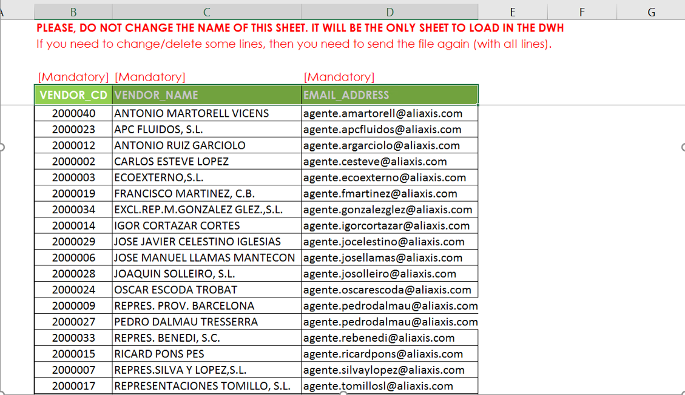

# Manual Uploads Process Guide (draft)

 

## Summary
This document covers the details of loading data from the manually uploaded file by Aliaxis business users. A business user would drop an excel or csv file on SharePoint from where it will be picked by the manual upload process flow and once this file is loaded in to target table i-e respective snowflake tables, the uploaded file will be archived. This entire process will enable the end users to access the data in snowflake from their manually created excel files.

 

## High level flow of loading Manual Upload File to Snowflake
Following is the sequence of step that are followed by the entire process to successfully loading data in snowflake table from manually uploaded files:
1.	Upload file on SharePoint
2.	Logic App will pick up once the file is uploaded and put in ADLS raw    zone
3.	Manual upload ADF is triggered once file is dropped in ADLS raw zone
4.	ADF converts the excel file into a csv file
5.	This csv file is then placed into ADLS landing zone 
6.	After dropping a file in the ADLS landing zone, the snowflake copy command would trigger, and the CSV file would load into the final snowflake tables.

 

### Given below diagram shows the high-level flow of loading the uploaded file into the snowflake data warehouse.

 
 

## Steps to configure Manual Upload File from SharePoint to ODS
1.	Open the file. Copy the file structure and create a table in ODS with the same name as the file name. For example, we take ‘JIMTEN_AGENT_EMAIL_ADDRESS.xlsx’ file.

Below is the SQL for creating the table in the ODS
     
    `USE EMEA_DEV_ODS;`\
    `USE SCHEMA MANUAL_UPLOADS;`\
    `USE WAREHOUSE EMEA_DEV_ELT_WH;`  
    `CREATE OR REPLACE TABLE JIMTEN_AGENT_EMAIL_ADDRESS`
    `(`
    `VENDOR_CD INT,`
    `VENDOR_NAMEVARCHAR(16777216),EMAIL_ADDRESS VARCHAR(16777216),`
    `FILE_NAME VARCHAR(16777216), SF_TIMESTAMP TIMESTAMP_TZ(9) DEFAULT` `CURRENT_TIMESTAMP(),FILE_METADATA OBJECT,IS_DELETED BOOLEAN);`

    FILE_NAME, FILE_METADATA, IS_DELETED and SF_TIMESTAMP are extra metadata columns that have been added for the table maintenance purpose.
 

2.	Create the file directory in ADLS raw zone and upload the file. This is where the manual uploaded files will be dripped by logic apps.
    .

3. Create a file format in snowflake for data loading  
`create or replace file format` 
`EMEA_DEV_ODS.MANUAL_UPLOADS.jimten_agent_email_address_csv`\
`type = CSV`\
`ESCAPE = '~'`\
`EMPTY_FIELD_AS_NULL= TRUE`

    .

4.	Make respective new entries in metadata table. Below is the entry for the file ‘JIMTEN_AGENT_EMAIL_ADRESS.xlsx’ Below table represents the columns of metadata table and their corresponding descriptions.

    | Column Name | Description | Sample Entry |
    | :--- | :--- | :--- |
    | ETL_SOURCE_NAME | Path on SharePoint where the file is coming from | ES001/SECURITY/rls 
    | SOURCE_SCHEMA_NAME | source data format | EXCEL
    | SOURCE_TABLE_NAME | tab name in the excel sheet | Input
    | SOURCE_COLUMNS  | valid column range in the excel sheet which needs to be picked for data loading | B5:D10000000
    | SNOWFLAKE_DATABASE_NAME | Target DB Name in Snowflake | emea_dev_ods
    | SNOWFLAKE_SCHEMA_NAME | Target DB Schema Name in Snowflake | manual_uploads
    | SNOWFLAKE_TABLE_NAME | Target DB Table Name in Snowflake | jimten_rls_security
    | DIVISION_NAME | Division for which business rule is defined e.g., 'EMEA'| EMEA
    | ENVIRONMENT_NAME | Environment of metadata table where these entries are being recorded | DEV
    | ADLS_CONTAINER_NAME | ADLS container name as per the environment | gdp-dev
    | ADLS_DATA_AREA_NAME | landing zone folder in the ADLS container | lan
    | ADLS_SOURCE_NAME | folder name in the landing zone for manually uploaded files | manualuploads 
    | ADLS_SCHEMA_NAME | folder name in the landing zone for manually uploaded file for which this entry is made | ES001/SECURITY/rls 
    | ADLS_TABLE_NAME |  Represents the snapshot of the datat that is being copied from the manually uploaded file | jimten_rls_security_s 
    | SNOWFLAKE_FILE_FORMAT | Snowflake file format to be used in copy command | jimten_rls_security_csv
    | MAX_ROWS_PER_FILE | Max rows per file to be used in copy command | 1000000
    | TRUNCATE_TARGET_TABLE | Truncate target table to be used in copy command | TRUE
    | IS_ACTIVE | Is active to be used in copy command | TRUE
    | ADDITIONAL_FIELDS | Additional fields to be used in copy command

    Below is the sample insert command for this example 
    
    INSERT INTO META_LAN.ADLS_TABLE_METADATA(ETL_SOURCE_NAME,SOURCE_SCHEMA_NAME,SOURCE_TABLE_NAME,SOURCE_COLUMNS,SNOWFLAKE_DATABASE_NAME,SNOWFLAKE_SCHEMA_NAME,
    SNOWFLAKE_TABLE_NAME,DIVISION_NAME,ENVIRONMENT_NAME,ADLS_CONTAINER_NAME,ADLS_DATA_AREA_NAME,ADLS_SOURCE_NAME,ADLS_SCHEMA_NAME,ADLS_TABLE_NAME,SNOWFLAKE_FILE_FORMAT,
    MAX_ROWS_PER_FILE,TRUNCATE_TARGET_TABLE,IS_ACTIVE) 
    VALUES ('jimten-agent-email-address','EXCEL','Input','B5:D10000000','emea_dev_ods','manual_uploads','jimten_agent_email_address','EMEA','DEV','gdp-dev','lan','manualuploads',
    'jimten-agent-email-address','jimten_agent_email_address_s','jimten_agent_email_address_csv','1000000','False','TRUE')

5.  Run pipeline ‘Get Manual Uploads Excel and Copy’ in ADF and data will be loaded
