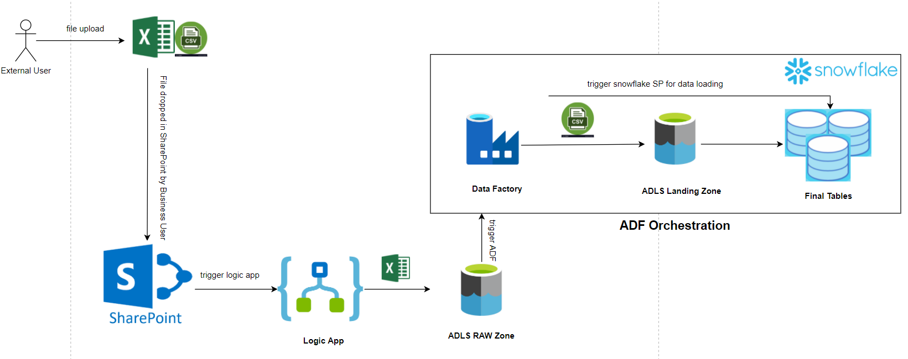
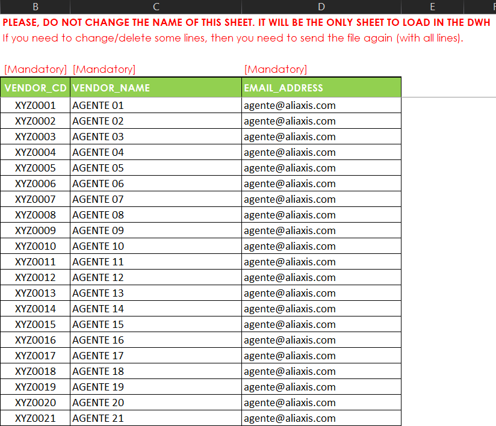
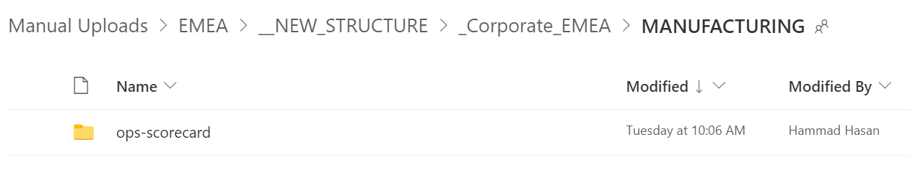

# Manual Upload Process

## Summary

This document covers the details of loading data from the manually uploaded file by Aliaxis business users. A business user would drop an excel or csv file on SharePoint, from where it will be picked by the manual upload process flow and once this file is loaded into target table i.e. respective snowflake tables, the uploaded file will be archived. This entire process will enable the end users to access the data in snowflake from their manually created excel files.

## High level flow of loading Manual Upload File to Snowflake

Following is the sequence of step that are followed by the entire process to successfully loading data in snowflake table from manually uploaded files:

1. Upload file on SharePoint
2. LogicApp will trigger once the file is uploaded (scans every 10 mins by default) and copy the file in ADLS raw zone
3. LogicApp will archive the file in an "Archive" folder (at same SharePoint location)
4. Manual upload ADF is triggered once file is received in ADLS raw zone
5. ADF converts the excel file into a csv file
6. This csv file is then placed into ADLS landing zone
7. After output a file in the ADLS landing zone, the snowflake copy command would trigger, and the CSV file gets loaded into the final snowflake table.

The following diagram shows the high-level data flow for loading the manually uploaded file into Snowflake

## Steps to configure Manual Upload File from SharePoint to ODS

1. [ BICC ] Open the file. Copy the file structure and create a table in ODS with the same name as the file name. For example, we take ‘JIMTEN\_AGENT\_EMAIL\_ADDRESS.xlsx’ file.  \
   Below is the SQL for creating the table in the ODS\
   `USE EMEA_DEV_ODS;`\
   `USE SCHEMA MANUAL_UPLOADS;`\
   `USE WAREHOUSE EMEA_DEV_ELT_WH;`\
   `CREATE OR REPLACE TABLE JIMTEN_AGENT_EMAIL_ADDRESS` `(` \
   `VENDOR_CD INT,` \
   `VENDOR_NAME VARCHAR(16777216),`\
   `EMAIL_ADDRESS VARCHAR(16777216),` \
   `FILE_NAME VARCHAR(16777216),` \
   `SF_TIMESTAMP TIMESTAMP_TZ(9) DEFAULT` `CURRENT_TIMESTAMP(),`\
   `FILE_METADATA OBJECT,`\
   `IS_DELETED BOOLEAN`\
   `);`\
   ``
   ``FILE\_NAME, FILE\_METADATA, IS\_DELETED and SF\_TIMESTAMP are extra metadata columns that have been added for the table maintenance purpose.

2. [ BICC ] Create the file directory on SharePoint. This is where the manual uploaded files will be dropped by the users.\
   &#x20;

3. [ BICC ] Create a file format in Snowflake for data loading\
    For example,\
    `create or replace file format` `EMEA_DEV_ODS.MANUAL_UPLOADS.jimten_agent_email_address_csv`\
    `type = CSV`\
    `ESCAPE = '~'`\
    `EMPTY_FIELD_AS_NULL= TRUE;`

4. [ BICC ] Make respective new entries in Snowflake metadata table. \
    Below is the entry for the file ‘JIMTEN\_AGENT\_EMAIL\_ADRESS.xlsx’. The table represents the columns of metadata table and their corresponding descriptions.

    | Column Name               | Description                                                                               | Sample Entry               |
    | ------------------------- | ----------------------------------------------------------------------------------------- | -------------------------- |
    | ETL\_SOURCE\_NAME         | Path on SharePoint where the file is coming from                                          | ES001/SECURITY/rls         |
    | SOURCE\_SCHEMA\_NAME      | source data format                                                                        | EXCEL                      |
    | SOURCE\_TABLE\_NAME       | tab name in the excel sheet                                                               | Input                      |
    | SOURCE\_COLUMNS           | valid column range in the excel sheet which needs to be picked for data loading           | B5:D10000000               |
    | SNOWFLAKE\_DATABASE\_NAME | Target DB Name in Snowflake                                                               | emea\_dev\_ods             |
    | SNOWFLAKE\_SCHEMA\_NAME   | Target DB Schema Name in Snowflake                                                        | manual\_uploads            |
    | SNOWFLAKE\_TABLE\_NAME    | Target DB Table Name in Snowflake                                                         | jimten\_rls\_security      |
    | DIVISION\_NAME            | Division for which business rule is defined e.g., 'EMEA'                                  | EMEA                       |
    | ENVIRONMENT\_NAME         | Environment of metadata table where these entries are being recorded                      | DEV                        |
    | ADLS\_CONTAINER\_NAME     | ADLS container name as per the environment                                                | gdp-dev                    |
    | ADLS\_DATA\_AREA\_NAME    | landing zone folder in the ADLS container                                                 | lan                        |
    | ADLS\_SOURCE\_NAME        | folder name in the landing zone for manually uploaded files                               | manualuploads              |
    | ADLS\_SCHEMA\_NAME        | folder name in the landing zone for manually uploaded file for which this entry is made   | ES001/SECURITY/rls         |
    | ADLS\_TABLE\_NAME         | Represents the snapshot of the datat that is being copied from the manually uploaded file | jimten\_rls\_security\_s   |
    | SNOWFLAKE\_FILE\_FORMAT   | Snowflake file format to be used in copy command                                          | jimten\_rls\_security\_csv |
    | MAX\_ROWS\_PER\_FILE      | Max rows per file to be used in copy command                                              | 1000000                    |
    | TRUNCATE\_TARGET\_TABLE   | Truncate target table to be used in copy command                                          | TRUE                       |
    | IS\_ACTIVE                | Is active to be used in copy command                                                      | TRUE                       |
    | ADDITIONAL\_FIELDS        | Additional fields to be used in copy command                                              |                            |

    Below is the sample insert command for an example:

    `INSERT INTO META_LAN.ADLS_TABLE_METADATA(ETL_SOURCE_NAME,SOURCE_SCHEMA_NAME,SOURCE_TABLE_NAME,SOURCE_COLUMNS,SNOWFLAKE_DATABASE_NAME,SNOWFLAKE_SCHEMA_NAME, SNOWFLAKE_TABLE_NAME,DIVISION_NAME,ENVIRONMENT_NAME,ADLS_CONTAINER_NAME,ADLS_DATA_AREA_NAME,ADLS_SOURCE_NAME,ADLS_SCHEMA_NAME,ADLS_TABLE_NAME,SNOWFLAKE_FILE_FORMAT, MAX_ROWS_PER_FILE,TRUNCATE_TARGET_TABLE,IS_ACTIVE) VALUES ('jimten-agent-email-address','EXCEL','Input','B5:D10000000','emea_dev_ods','manual_uploads','jimten_agent_email_address','EMEA','DEV','gdp-dev','lan','manualuploads', 'jimten-agent-email-address','jimten_agent_email_address_s','jimten_agent_email_address_csv','1000000','False','TRUE')`\
    ``
5. Drop file(s) on respective SharePoint folder to trigger the pipeline in ADF for data ingestion

## Planned Features

1. Support for delete-insert based on unique column. To avoid the duplicates in the target table when `TRUNCATE\_TARGET\_TABLE` is marked as false. (`In Progress`)
