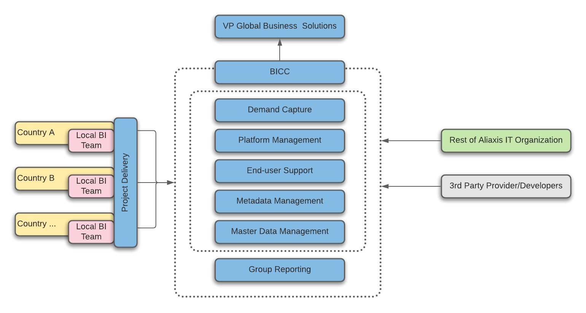

# BICC Organization

Local projects are delivered by local teams but supported by the BICC. 

Implementation of group reporting will be done by BICC. 

Other functions of BICC include demand management, platform management, data and metadata management and support.

## Spectrum of Responsibility

The image below shows the spectrum of responsibility, that is, who is responsible for what when developing in the GDP. However, it can be summarized in two points.

* Ingestion of the data from source systems into the GDP \(raw zone\) and making it available for the local teams to consume is the responsibility of the BICC. 
* Reading the data from ODS, transforming it through the staging layer, and delivering the Data Marts is the responsibility of the local development teams.

BICC still remains available for supporting local implementation teams with guidance and coaching on the use of the GDP components.

 Figure 11 Spectrum of Responsibility

