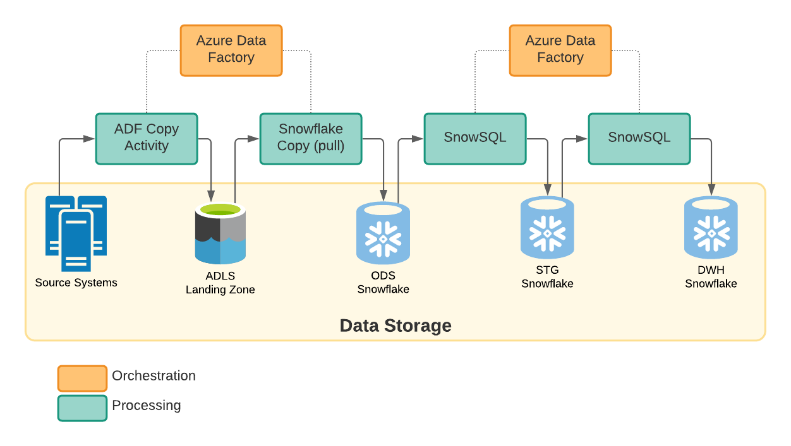

# High-Level Design

The following image shows the high-level architecture of the Global Data Platform. Two options are shown for the ingestion of data into the Global Data Platform. Azure integration Runtime is used for data ingestion if Data Factory is used otherwise an ETL/ELT tool can be used directly to write data into ADLS Gen2. Some ETL/ELT tools can write the data directly to Snowflake but for the purpose of standardization, data will be copied to ADLS first. Using ADLS as a landing zone allows the use of other data analytics tools such as Databricks.

The general structure of the data processing pipelines running on the Global Data Platform \(GDP\) follow the structure shown below

The blocks in green represent data processing activities, and the blocks in orange are showing the orchestration engine. The light yellow block shows the areas where data is stored.

