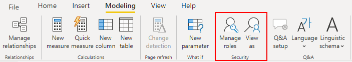

# Power BI

## General Guideline

All Power BI artifacts **must** be stored in project-specific workspaces. Each data-platform project will have:

* 1 Development workspace: This workspace will be used for development and user acceptance testing
* 1 Production workspace: This workspace is where stable reports are deployed. End users will access these reports via a Power BI app. 

## Workspaces

Workspaces are places to collaborate with colleagues to create collections of dashboards, reports, and datasets. By default, every Power BI user has a "My Workspace" workspace. This "My Workspace" workspace should never be used for developing Power BI artifacts that are related to a data-platform project.

When a data-platform project is ready to begin creating reports and dashboards in Power BI, a new workspace needs to be created.

### The Development Workspace

This is where new reports and dashboards are created by the developers, it is like the Dev environment for Power BI. All reports and dashboards being created in this workspace are available for other users to edit and enhance.

When a report is ready to be tested by a user, a workspace app needs to be created \(by the Project Lead, see App Organization and Governance\), and the report needs to be included in the app. This \(development\) app will then be shared with the user\(s\) that need to validate the report and provide feedback. Once the report is ready to be sent to production, the report must be published in the Production Workspace.

### The Production Workspace

The production workspace contains stable and validated reports that end users can now consume. To share reports with end users, the Project Lead must create an app for the production workspace, and include all reports that have been published into the workspace.

The app must then be shared with end-users who will access the app and be able to consume all reports that have been deployed in it.

> Note:
>
> Reports that exist in the production workspace should **never** be modified directly in this workspace. If any modification is needed, the report must be changed and published in the development workspace; then validated by the user using the dev workspace's app. When all validations have been done and the report is ready for production, the report must be published to the Production workspace.

### Organization and Governance

New workspaces for data-platform projects must be created and are owned by the project lead. The project lead is therefore in charge of creating the development and production workspaces, and must also assign the proper team to them.

The development team must be assigned with the role Member. This role grants sufficient rights for them to create and update reports and the workspace app.

The Division lead should be added to the workspace with the role Admin. At least one BICC representative should be added to every workspace with the role Admin.

### Naming convention

For the sake of naming standardization, ease of finding workspaces, and to understand what is contained in each workspace, the following naming convention should be followed. GDP - Division - Project Name \[Dev\]

GDP: This prefix is standard and should be the beginning of all workspaces that contain reports and dashboards related to data-platform projects. This will help to visually have all data-platform workspaces together in the workspace list.

Division: This is the acronym for the division, as follows.

* EMEA: Workspaces for the EMEA division.
* NA: Workspaces for the North American division.
* APAC: Workspaces for Asia Pacific.
* LATAM: Workspaces for Latin America.
* INDIA: Workspaces for India.
* GLOBAL: Workspaces for Group \(HQ\). These projects are usually managed and worked on by the BICC.
* BICC: Workspaces for BICC reporting \(monitoring, logging, consumption reports, etc.\) 

Project Name \[Dev\]: This is the last part of the workspace name, and it should be the project name. Spaces are allowed in the project name. The \[Dev\] indicates that the development workspace should have the word Dev as a suffix.

> Note:
>
> The 3 parts of the workspace name are separated by a hyphen with a space; this is done to make names easier to read.

## Apps

A Power Bi app is a content type that combines related dashboard and reports in one place. An app can have one or more dashboards and one or more reports, and they are grouped in a container-like object called App.

Apps are an easy way for report designers to share different types of content with end users at once. Once a Power BI app is published and shared with end users, they \(end users\) can access all reports and dashboards contained within the app. End users can install the Power BI app in the Power BI service and in their mobile phone.

Furthermore, if needed, access can be given so users have access to the app's underlying datasets, so they can build reports \(on other workspaces\) using the datasets that are being used by the app.

### Organization and Governance

Apps must be created by the Project lead. The project lead is therefore responsible for managing access to the App, and for publishing whenever a change is needed.

The Project lead will create a Power BI app for the development workspace when end-users need to access the reports being developed, for testing purposes.

When reports are ready to be distributed to end users, the Project Lead will create the app for the production workspace, and publish all reports within the app.

### Naming convention

All apps should be named exactly as the workspace to where they belong. For example, if an app is being created for a workspace called "GDP - BICC - Snowflake Consumption Monitoring", then the app should be named "GDP - BICC - Snowflake Consumption Monitoring".

## Row-Level Security \(RLS\)

Row-level security is a security feature that, when present in a report, lets you limit the data that is visible by a user based on different roles. Instead of hiding entire tables and visuals, you can keep those tables visible, but hide specific rows of data from certain users. 

There are generally 2 ways of adding row-level security \(RLS\) to Power BI reports.

* Via roles integrated in Power BI

* Via security tables in the data source \(i.e. Snowflake\)

#### Power BI Integrated Row-Level Security

The row-level security functionality in Power BI is used by adding filters to restrict data access at the row level; these filters can be defined within Power BI roles. 

#### When to use Power BI Integrated RLS?

The RLS integrated in Power BI is **not** the default or recommended approach for the majority of use cases; however, there are cases when this RLS method is approved to be used. 

* When the report is built for a Proof of Concept \(POC\) purpose. In this case, the report is not intended to go live with a large userbase, but agility is needed to prove a functionality.
* When reports are built in **Import Mode**. In this scenario, RLS cannot be achieved in any other way, since data refresh happens under one specific user, and user-initiated refreshes don't go to Snowflake. 

