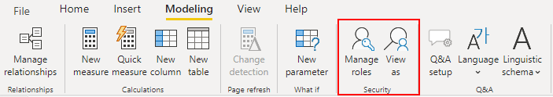

# Power BI

## General Guideline

All Power BI artifacts **must** be stored in project-specific workspaces. Each data-platform project will have:

* 1 Development workspace: This workspace will be used for development and user acceptance testing
* 1 Production workspace: This workspace is where stable reports are deployed. End users will access these reports via a Power BI app. 

## Workspaces

Workspaces are places to collaborate with colleagues to create collections of dashboards, reports, and datasets. By default, every Power BI user has a "My Workspace" workspace. This "My Workspace" workspace should never be used for developing Power BI artifacts that are related to a data-platform project.

When a data-platform project is ready to begin creating reports and dashboards in Power BI, a new workspace needs to be created.

### The Development Workspace

This is where new reports and dashboards are created by the developers, it is like the Dev environment for Power BI. All reports and dashboards being created in this workspace are available for other users to edit and enhance.

When a report is ready to be tested by a user, a workspace app needs to be created \(by the Project Lead, see App Organization and Governance\), and the report needs to be included in the app. This \(development\) app will then be shared with the user\(s\) that need to validate the report and provide feedback. Once the report is ready to be sent to production, the report must be published in the Production Workspace.

### The Production Workspace

The production workspace contains stable and validated reports that end users can now consume. To share reports with end users, the Project Lead must create an app for the production workspace, and include all reports that have been published into the workspace.

The app must then be shared with end-users who will access the app and be able to consume all reports that have been deployed in it.


**Note:** Reports that exist in the production workspace should never be modified directly in this workspace. If any modification is needed, the report must be changed and published in the development workspace; then validated by the user using the dev workspace's app. When all validations have been done and the report is ready for production, the report must be published to the Production workspace.


### Organization and Governance

New workspaces for data-platform projects must be created and are owned by the project lead. The project lead is therefore in charge of creating the development and production workspaces, and must also assign the proper team to them.

The development team must be assigned with the role Member. This role grants sufficient rights for them to create and update reports and the workspace app.

The Division lead should be added to the workspace with the role Admin. At least one BICC representative should be added to every workspace with the role Admin.

### Naming convention

For the sake of naming standardization, ease of finding workspaces, and to understand what is contained in each workspace, the following naming convention should be followed. GDP - Division - Project Name \[Dev\]

GDP: This prefix is standard and should be the beginning of all workspaces that contain reports and dashboards related to data-platform projects. This will help to visually have all data-platform workspaces together in the workspace list.

Division: This is the acronym for the division, as follows.

* EMEA: Workspaces for the EMEA division.
* NA: Workspaces for the North American division.
* APAC: Workspaces for Asia Pacific.
* LATAM: Workspaces for Latin America.
* INDIA: Workspaces for India.
* GLOBAL: Workspaces for Group \(HQ\). These projects are usually managed and worked on by the BICC.
* BICC: Workspaces for BICC reporting \(monitoring, logging, consumption reports, etc.\) 

Project Name \[Dev\]: This is the last part of the workspace name, and it should be the project name. Spaces are allowed in the project name. The \[Dev\] indicates that the development workspace should have the word Dev as a suffix.


**Note:** The 3 parts of the workspace name are separated by a hyphen with a space; this is done to make names easier to read.


## Apps

A Power Bi app is a content type that combines related dashboard and reports in one place. An app can have one or more dashboards and one or more reports, and they are grouped in a container-like object called App.

Apps are an easy way for report designers to share different types of content with end users at once. Once a Power BI app is published and shared with end users, they \(end users\) can access all reports and dashboards contained within the app. End users can install the Power BI app in the Power BI service and in their mobile phone.

Furthermore, if needed, access can be given so users have access to the app's underlying datasets, so they can build reports \(on other workspaces\) using the datasets that are being used by the app.

### Organization and Governance

Apps must be created by the Project lead. The project lead is therefore responsible for managing access to the App, and for publishing whenever a change is needed.

The Project lead will create a Power BI app for the development workspace when end-users need to access the reports being developed, for testing purposes.

When reports are ready to be distributed to end users, the Project Lead will create the app for the production workspace, and publish all reports within the app.

### Naming convention

All apps should be named exactly as the workspace to where they belong. For example, if an app is being created for a workspace called "GDP - BICC - Snowflake Consumption Monitoring", then the app should be named "GDP - BICC - Snowflake Consumption Monitoring".

## Power BI Datasets

When data is imported \(using Import Mode\) or referenced \(using DirectQuery Mode\) from Power BI Desktop, Power BI will create a dataset that contains the tables/views and relationships that are being used in the report. When a report is published into the Power BI Service, the dataset \(or underlying data model\) is published alongside the report itself. 

Datasets are Power BI's way of sharing data without sharing a report, which is a collections of visual representations of that data. Power BI datasets can therefore become the _one source of truth_ when it comes to how data is consumed from Power BI. 

Just like reports and apps, Power BI Datasets can be shared with other Power BI users in the organization,  which can enable data sharing and self-service capabilities.


**Note:** Sharing a dataset doesn't automatically grant access to all the data referenced in the dataset. Proper permissions must be given at the data source level for users to be able to access the data.


### Reusing Datasets

Since Power BI datasets can be shared with other users, that means that data models that have been built and proven to be accurate can be re-used by other users without having to rethink \(or reinvent\) these models. This is what reusing \(sharing\) datasets is all about, sharing knowledge about a certain data topic, so other users can _"just use"_ the data without worrying about its validity or accuracy. 

Sharing Power BI datasets is highly encouraged for cases where self-service analytics or reporting is relevant, since most of the modelling work would have already been done by the dataset owner, who is to be considered knowledgeable enough about the data, that his work is taken as valid and approved.

### Dataset Certification

Going further into dataset sharing and data accuracy, Power BI Datasets can be certified or promoted. Both options are ways to endorse the content that has been created, to increase visibility and reuse. 

For more information about Endorsing Datasets, please refer to the Microsoft documentation in [this link](https://docs.microsoft.com/en-us/power-bi/collaborate-share/service-endorse-content).

## Row-Level Security \(RLS\)

Row-level security is a security feature that, when present in a report, lets you limit the data that is visible by a user based on different roles. Instead of hiding entire tables and visuals, you can keep those tables visible, but hide specific rows of data from certain users. 

There are generally 2 ways of adding row-level security \(RLS\) to Power BI reports.

* Via roles integrated in Power BI

* Via security tables in the data source \(i.e. Snowflake\)

### Power BI Integrated Row-Level Security

The row-level security functionality in Power BI is used by adding filters to restrict data access at the row level; these filters can be defined within Power BI roles. 

#### When to use Power BI Integrated RLS?

The RLS integrated in Power BI is **not the default or recommended** approach for the majority of use cases; however, there are cases when this RLS method is approved to be used. 

* When the report is built for a Proof of Concept \(POC\) purpose. In this case, the report is not intended to go live with a large userbase, but agility is needed to prove a functionality.
* When reports are built in **Import Mode**. In this scenario, RLS cannot be achieved in any other way, since data refresh happens under one specific user, and user-initiated refreshes don't go to Snowflake. 

### Security Tables in data source \(Snowflake\)

Having the RLS model in the data source is the recommended approach for most of row-level security needs. This approach provides great flexibility and support future changes in the data platform architecture \(i.e. future-proof\). 

By having security tables built in the data source, the RLS will work in cases where people access the data from Power BI \(in direct connection mode\), and also when users access the data from other tools \(for example, MS Excel\). 

#### When to use RLS based on Security Tables in the data source? 

This method is the recommended approach for all row-level security scenarios except the ones mentioned in "When to user Power BI Integrated RLS". 

## Import or DirectQuery Mode?

**Import Mode** copies the data set into Power BI desktop. To refresh the data with the latest changes from the data source, the entire data set must be re-imported into Power BI.

#### Pros of Import Mode

* All Power BI features are available in Import Mode, like alternative login to database connection, relationship filtering with "Both" directions. 
* It can be faster than DirectQuery Mode, since the data is loaded into memory and queries are read from the data residing in memory.
* New and calculated columns are fully supported
* Does not consume Snowflake credits when users update the report, since the data is already loaded in the Power BI dataset. The only time Snowflake credits are consumed is when the dataset is refreshed \(which can be controlled\)

#### Cons of Import Mode

* Depending on the dataset size, it can consume a lot of memory and space
* The file size of the Power BI, including the data, cannot exceed 1 GB; which can restrict the usage of Import Mode for large datasets. 
* Row-level Security must be done in Power BI, cannot use RLS from the source.

**DirectQuery Mode** connects Power BI directly to the data source, allowing for information to be always up to date. There is no data integrated in the Power BI file, therefore the file size remains small. 

#### Pros of DirectQuery Mode

* Data is always current
* File size limit of 1 GB is no longer an issue
* Allows for building reports with large datasets
* Allows for using row-level security based on tables in the source.
* Since Row-level Security needs to be done in the source \(i.e. Snowflake\), there is great flexibility in its implementation. 

#### Cons of DirectQuery Mode

* Can be slower than Import Mode
* Not all Power BI features are available. Availability will depend on the data source and type of data being used. 
* Not all DAX functions are supported
* Time capabilities \(for YTD calculations, for example\) are sometimes not supported
* Each time data needs to be updated, it will consume Snowflake credits, which means there is a cost associated to the increased performance and higher volume of data. 

