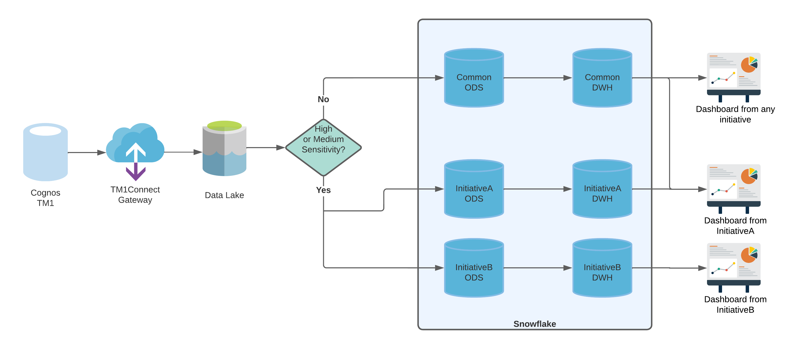
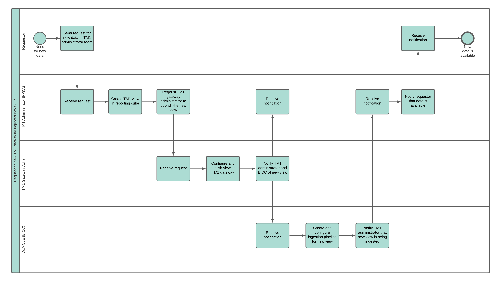

## General Definition

The TM1 Gateway is meant to act as a middle layer between IBM Cognos TM1 (financial planning and analytics tool) and Snowflake, our cloud data warehouse. 

The tool that has been implemented as the TM1 Gateway is [TM1Connect](http://www.tm1connect.com/). As per the TM1Connect documentation
> TM1Connect is a middle-tier application that provides translation services of multi-dimensional data stored in IBM Cognos TM1, into a format readily consumed by tabular or relational style applications, such as Power BI, QlikView, Tableau or any other ODBC compliant software such as Microsoft Access or Microsoft Excel. TM1Connect understands cubes, dimensions, hierarchies, and attributes to quickly and easily transfer both data and metadata into a record-style format that many applications natively support.

## Ways of using TM1Connect

TM1 Connect supports 2 basic ways of retrieving data from TM1

1. **Batch Mode**: This mode allows to export files (for example, CSV) that are generated on a scheduled basis
2. **On-Demand Mode**: This mode uses ODBC (or a specialized QlikView connector) to allow connectivity from any ODBC-compliant application, such as Power BI or Excel. 
   

**Note:** In our case, we use the ODBC connection (on-demand mode) to extract information from TM1 by using Azure Data Factory.


## Configuring TM1Connect

Once TM1Connect is installed, there is a configuration utility available that allows to configure the different aspects of the tool: 
- Security: integrated, basic, or anonymous
- Connection to TM1: Native API or OData
- Administrative credentials


**Note:** The TM1Connect configuration only needs to be done once and has already taken place. The above is for information purposes only.


### Installing and configuring the ODBC Driver

With TM1Connect properly configured, and to allow the connection from Azure Data Factory to TM1Connect, the TM1Connect ODBC driver must be installed and configured. 

The ODBC driver can be downloaded from the TM1Connect [website](https://tm1connect.com/).

On the server that is hosting the Self-Hosted Azure Integration Runtime, a new ODBC data source must be created using the TM1Connect driver. This data source must point to the TM1Connect server.

## TM1Connect Views

TM1Connect uses "views" to expose data via direct connection (on-demand) or batch mode. These TM1Connect views can be created directly in TM1Connect, or they can be views that already exist in TM1. 

Once the view has been created (in TM1Connect), it needs to be published to make it accessible. This is done by activating the option "Publish View to Web Service" in the TM1Connect View Properties.

## TM1 Data Security

Since the data that exists in TM1 is generally "restricted", it is important to keep it secured once it is ingested into the data platform (Snowflake). To achieve this, the BICC has agreed to architect the TM1 data on a use case by use case basis. This means that for each *new* TM1 data that must be ingested, the following questions must be asked and answered.

- Is this data **only** relevant for this use case?
- Who (which initiative), besides the requestor, will need access to this data?
- How sensitive is the information being requested (High, Med, Low)
  - *High:* Data is private and should **absolutely not** be shared with other initiatives besides the requestor.
  - *Medium:* Data is confidential; it could be shared with other initiatives if proper authorization is provided.
  - *Low:* Data is public to Aliaxis users; sharing with other initiatives is encouraged.

## Requesting new TM1 data

The process for requesting new data follows a flow like the one shown below.

